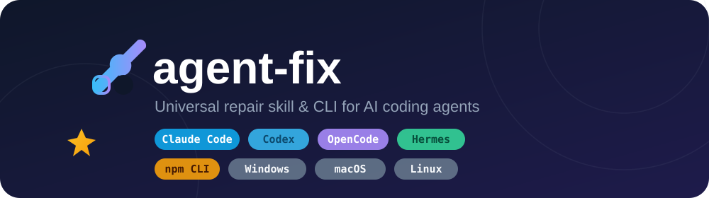

<div align="center">

<p align="center">

</p>

# agent-fix 

**Universal repair skill &amp; CLI for ALL AI coding agents** — fix Claude Code,
Codex, OpenCode, Hermes, Kimi Code, Pi, ZCode, Cursor, Gemini CLI, Aider, Qwen
Code and any npm-distributed CLI with one skill, in the terminal, from a program,
or from inside another agent.

English / [简体中文](README_cn.md)

[](LICENSE)
[]()
[]()
[]()

</div>

## Table of Contents

- [Why agent-fix](#why-agent-fix)
- [Features](#features)
- [Quick Start](#quick-start)
- [Usage](#usage)
  - [CLI commands](#cli-commands)
  - [Compatibility matrix](#compatibility-matrix)
  - [Issue catalog](#issue-catalog)
  - [Use it from your programs](#use-it-from-your-programs)
  - [MCP server (12 tools for any agent)](#mcp-server-12-tools-for-any-agent)
- [How it works](#how-it-works)
- [Extending the catalog](#extending-the-catalog)
- [FAQ](#faq)
- [Related](#related)
- [License](#license)

## Why agent-fix

AI coding agents are installed, upgraded, and switched by all kinds of tooling — npm,
GUI switchers (CC-Switch), version managers — and when that tooling misbehaves, every
agent breaks in familiar ways:

- `opencode --version` → **"postinstall script was not run"** (the classic
  `ignore-scripts` / `--ignore-scripts` trap, recurring on **every upgrade**)
- `claude --version` → **"native binary not installed"**
- CC-Switch says **"installed · cannot run"** while the terminal works fine
- `EBADENGINE`, `ETIMEDOUT`, `401 Unauthorized`, `Not logged in` …

Fixes for these are scattered across GitHub issues and chat logs. **agent-fix** collects
them into one versioned, machine-readable catalog (`catalog.json`) plus human-readable
docs (`fixes/*.md`), and ships a zero-dependency CLI (`scripts/fix.py`) that
diagnoses, repairs, and verifies — on Windows, macOS, and Linux.

It was born from a real recurring incident: OpenCode and Claude Code broke five times
in five days on one machine, always the same root cause, always a different manual
command. This skill makes that repair one command: `fix apply npm-postinstall-skipped --yes`.

## Features

- 🔧 **7 issue classes, 1 command** — `fix doctor` checks everything; `fix apply <id>` repairs and verifies
- 🤖 **Every agent, registry-driven** — an agent registry in `catalog.json` covers Claude Code, Codex, OpenCode, Hermes, Kimi Code, Pi, ZCode, Cursor, Gemini CLI, Aider, Qwen Code, Amp, Droid + any npm CLI; `fix doctor` checks **every agent installed on your machine**, not just the big four. New agents = one line of data, no code
- 🖥️ **Cross-platform** — Windows (incl. Git Bash & WSL-aware), macOS, Linux
- 🧩 **Skill + CLI + API** — loadable as a skill by agents, callable from a terminal, or importable as a Python module
- ⚡ **MCP server** — a zero-dependency stdio MCP server (`mcp/server.py`, 12 tools) lets Claude Code, OpenCode, Cursor, ZCode, Codex call the whole toolbox (`fix_doctor`, `net_diagnose`, `deepseek_setup`, …) as native tools
- 📦 **Zero dependencies** — pure Python 3.8+ stdlib
- 🔁 **Watchdog-ready** — `fix auto` checks and auto-repairs; non-zero exit on failure drops straight into cron/CI
- 🧪 **Verified fixes** — every fix ends with a real verification step, not just `--version`

## Quick Start

```bash
git clone https://github.com/qingzhuo-cn/agent-fix-skill.git
cd agent-fix-skill

# 1) CLI — no install needed
./scripts/fix doctor

# 2) install the skill into your agents (Claude Code / OpenCode / Hermes / Codex hook)
./install/install.sh            # POSIX or Git Bash
powershell -File install\install.ps1   # Windows PowerShell

# 3) try it
fix list
```

Windows users: full check coverage requires Git Bash (the CLI auto-detects it and
falls back to cmd.exe for npm/node/registry checks).

## Usage

### CLI commands

| Command | What it does | Exit code |
|---------|--------------|-----------|
| `fix list` | list every known issue | 0 |
| `fix agents` | list the agent registry and which agents are installed | 0 |
| `fix check` | run all diagnostics (incl. per-agent binary checks) | 0 healthy / 1 broken |
| `fix check <id>...` | run diagnostics for specific issues | 0 / 1 |
| `fix doctor` | alias for `fix check` | 0 / 1 |
| `fix apply <id> [--yes]` | apply fixes for one issue, then verify | 0 verified |
| `fix auto` | check all → auto-apply fixes for broken ones (watchdog) | 0 all fixed |
| `fix info <id>` | print the matching doc from `fixes/` | 0 |
| `fix --json` / `fix check --json` | machine-readable output for programs | — |

Typical session:

```bash
$ fix doctor
== npm-postinstall-skipped: npm postinstall skipped -> native binary missing
    [FAIL] opencode binary runs
          Error: postinstall script was not run
   -> BROKEN. Fix with: fix apply npm-postinstall-skipped --yes

$ fix apply npm-postinstall-skipped --yes
    [FIX ] Re-run opencode postinstall        → ok (12.4s)
    [FIX ] Re-run claude-code install script  → ok (1.1s)
    [VERIFY OK] opencode --version            → v1.18.10
    [VERIFY OK] claude --version              → 2.1.220 (Claude Code)
=> verified OK
```

### Compatibility matrix

| Agent | Skill format | Install path | Auto-loaded? |
|-------|-------------|--------------|--------------|
| Hermes | `SKILL.md` | `~/.local/share/hermes/skills/agent-fix/` (Win: `%LOCALAPPDATA%\hermes\skills\agent-fix\`) | ✅ |
| Claude Code | `SKILL.md` | `~/.claude/skills/agent-fix/` | ✅ |
| Codex CLI | `SKILL.md` + `AGENTS.md` | `~/.codex/skills/agent-fix/` | ✅ |
| OpenCode | `SKILL.md` + `AGENTS.md` | `~/.config/opencode/skill/agent-fix/` | ✅ |
| Kimi Code | `SKILL.md` (auto-discovered) | `~/.kimi-code/skills/agent-fix/` | ✅ |
| Pi | `SKILL.md` | `~/.pi/agent/skills/agent-fix/` | ✅ |
| ZCode & shared | `SKILL.md` | `~/.agents/skills/agent-fix/` | ✅ |
| Cursor, others | `AGENTS.md` | repo root | ✅ |
| Any npm CLI | `fix` CLI | `~/bin/fix` | n/a |

> All 13 registry agents (incl. Gemini CLI, Aider, Qwen Code, Amp, Droid) are
> detected and health-checked by `fix doctor` even when the skill itself isn't
> installed — see [fixes/agent-matrix.md](fixes/agent-matrix.md).

### Issue catalog

| ID | Problem | Affected agents | Doc |
|----|---------|-----------------|-----|
| `agent-broken-generic` | ANY detected agent's binary fails (dynamic check, registry-driven) | all | [doc](fixes/agent-matrix.md) |
| `npm-postinstall-skipped` | npm `ignore-scripts`/`--ignore-scripts` skips postinstall → native binary missing | claude-code, opencode, codex, pi, any npm CLI | [doc](fixes/npm-postinstall.md) |
| `gui-path-blind` | GUI apps (CC-Switch, ZCode Desktop etc.) can't see agent binaries (registry PATH) | all agents, CC-Switch | [doc](fixes/gui-path.md) |
| `node-version-too-old` | Node too old for the agent's engines → startup crash | claude-code, codex, opencode, pi | [doc](fixes/node-version.md) |
| `npm-registry-mirror` | npm install/upgrade slow or unreachable | all npm agents | [doc](fixes/npm-registry.md) |
| `agent-auth-broken` | "Not logged in" / expired OAuth / missing key | claude-code, codex, kimi-code, pi | [doc](fixes/agent-auth.md) |
| `deepseek-provider` | point any agent at the DeepSeek API (deepseek-chat / deepseek-reasoner) | claude-code, codex, opencode, hermes, kimi-code, pi, zcode | [doc](fixes/deepseek-provider.md) |

Per-agent deep dives: [Kimi Code](fixes/kimi-code.md) · [Pi](fixes/pi.md) · [ZCode](fixes/zcode.md)

### Use it from your programs

```python
import sys
sys.path.insert(0, "/path/to/agent-fix-skill/scripts")
from fix import load_catalog, check_issue, apply_issue, auto_fix

catalog = load_catalog()
issue = next(i for i in catalog["issues"] if i["id"] == "npm-postinstall-skipped")

state = check_issue(issue, quiet=True)          # diagnose
print("broken" if state["broken"] else "healthy")

outcome = apply_issue(issue, yes=True, quiet=True)  # repair + verify
print("verified:", outcome["verified"])
```

Or call it as a subprocess with `--json`:

```python
import json, subprocess
out = subprocess.run(["fix", "check", "--json"], capture_output=True, text=True)
report = json.loads(out.stdout)
```

### MCP server (12 tools for any agent)

The same toolbox is exposed as an MCP server, so **any MCP-capable agent**
(Claude Code, OpenCode, Cursor, ZCode, Codex) can call it as native tools:

| Group | Tools |
|-------|-------|
| Core inspect/fix | `fix_agents`, `fix_doctor`, `fix_check`, `fix_apply`, `fix_info` |
| Branch skills | `net_diagnose` (endpoint latency + proxy), `version_check`, `config_audit` (parse errors + leaked keys), `log_triage`, `backup_configs`, `restore_configs`, `deepseek_setup` |

```bash
python scripts/mcp_register.py all        # register with every installed agent
claude mcp list | grep agent-fix          # verify: ✔ Connected
```

Then just talk to your agent: *"run fix_doctor and tell me what's broken"*,
*"net_diagnose — is DeepSeek reachable?"*, *"backup_configs before I upgrade"*,
*"deepseek_setup with key sk-…"*. Full docs: [mcp/README.md](mcp/README.md).

## How it works

```
                ┌─────────────────────────────┐
                │       catalog.json          │  single source of truth
                │  checks · fixes · verify    │  (issue definitions)
                └──────────────┬──────────────┘
                               │
        ┌──────────────────────┬───────────────────────┬───────────────────┬──────────────┐
        ▼                      ▼                       ▼                   ▼
  fixes/*.md            scripts/fix.py           SKILL.md / AGENTS.md    mcp/server.py
  human & agent         CLI + Python API         agent-side loaders     12 MCP tools for
  knowledge base        (stdlib only)            (Hermes/Claude/OpenCode) any MCP-capable agent
```

Each issue in `catalog.json` is data — `checks` (diagnostics), `fixes` (repair
commands, with optional platform gating), and `verify` (post-fix confirmation). The
CLI is a thin engine over that data, so adding an issue never requires code changes.
The same content is mirrored in `fixes/*.md` for humans and agents that prefer prose.

## Extending the catalog

1. Append an issue block to `catalog.json` (`id`, `checks`, `fixes`, `verify`, `doc`).
2. Add a matching `fixes/<id>.md` doc.
3. Validate: `fix check <id>`; test the repair with `fix apply <id> --yes`.
4. Open a PR.

## FAQ

**Q: Why does OpenCode keep breaking after every upgrade?**
A: The npm install/upgrade skipped its `postinstall` script (see
[npm-postinstall.md](fixes/npm-postinstall.md)). Fix it once with
`fix apply npm-postinstall-skipped --yes`, then set up the watchdog:
`0 9 * * * cd /path/to/agent-fix-skill && ./scripts/fix auto >> fix.log 2>&1`.

**Q: CC-Switch says "installed · cannot run" but the terminal works.**
A: GUI apps don't inherit your shell PATH — they read the Windows registry PATH. Run
`fix apply gui-path-blind --yes`, then restart the GUI app. See
[gui-path.md](fixes/gui-path.md).

**Q: Can I use this with DeepSeek models?**
A: Yes — `deepseek-provider` shows exactly how to point Claude Code
(`ANTHROPIC_BASE_URL=https://api.deepseek.com/anthropic`), Codex/OpenCode
(`OPENAI_BASE_URL=https://api.deepseek.com`), and Hermes at the DeepSeek API. See
[deepseek-provider.md](fixes/deepseek-provider.md).

**Q: Does it need admin rights?**
A: No. Everything is user-level (config files, user PATH, per-user npm global).

**Q: Dependencies?**
A: None. `scripts/fix.py` is pure Python 3.8+ stdlib. Bash wrapper needs `bash`
(POSIX or Git Bash on Windows).

## Related

- [awesome-deepseek-integration](https://github.com/deepseek-ai/awesome-deepseek-integration) —
  the integration list that inspired the presentation of this repo
- [CC-Switch](https://github.com/farion1231/cc-switch) — the Claude/Codex/OpenCode
  provider switcher whose detection logic motivated the `gui-path-blind` doc
- [nvm-windows](https://github.com/coreybutler/nvm-windows) / [fnm](https://fnm.vercel.app) —
  recommended Node version managers

## License

[MIT](LICENSE)
